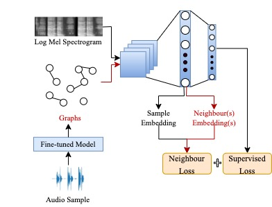

# NSL-SER
[](https://arxiv.org/abs/2210.14977)
[](https://opensource.org/licenses/MIT)



This is the code for the proposed neural structured learning (NSL) framework for speech emotion recognition (SER) in the following paper: 

>Yi Chang, Zhao Ren, Thanh Tam Nguyen, Kun Qian, and Björn W. Schuller. Knowledge Transfer For On-Device Speech Emotion Recognition with Neural Structured Learning. https://arxiv.org/abs/2210.14977

## Citation

```
@misc{ychang2022ser,
      title={Knowledge Transfer For On-Device Speech Emotion Recognition with Neural Structured Learning}, 
      author={Chang, Yi and Ren, Zhao and Nguyen, Thanh Tam and Qian, Kun and Schuller, Björn W.},
      year={2022},
      eprint={2210.14977},
      archivePrefix={arXiv},
      note={5 pages}
}
```

## Abstract

We propose a neural structured learning (NSL) framework through building synthesized graphs. An SER model is trained on a source dataset and used to build graphs on a target dataset. A lightweight model is then trained with the speech samples and graphs together as the input. Our experiments demonstrate that training a lightweight SER model on the target dataset with speech samples and graphs can not only produce small SER models, but also enhance the model performance over models with speech samples only.


## Experiments Running

Both python files can be run via

```
sh run.sh
```
